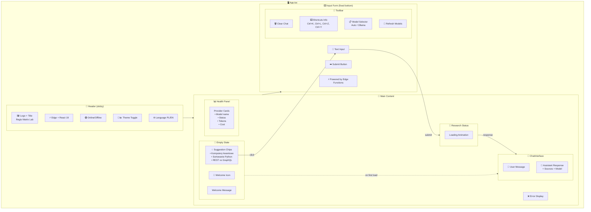
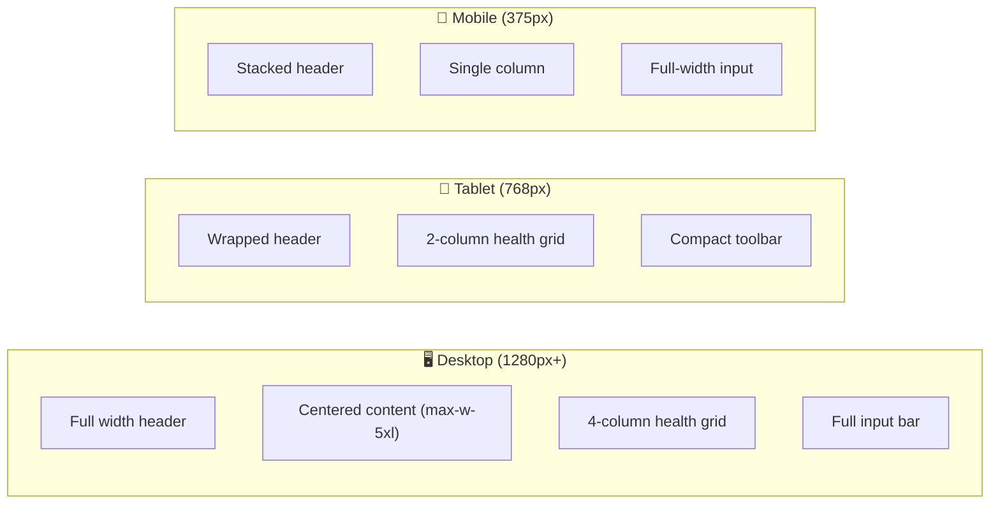
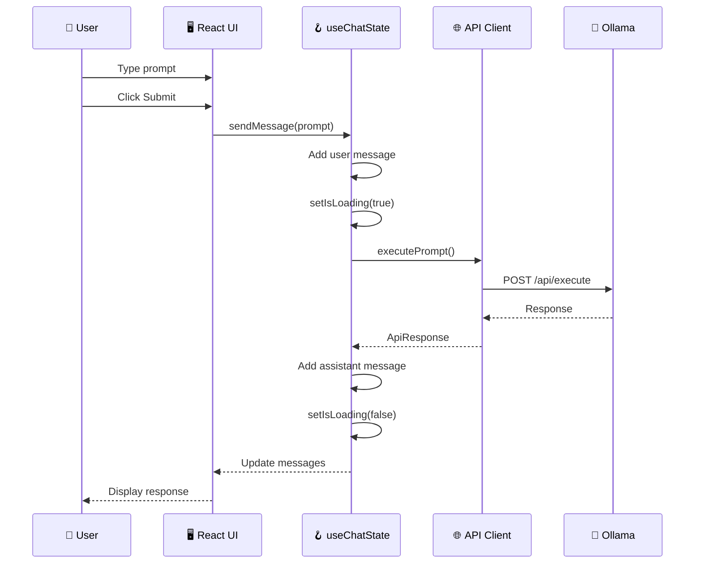

# Regis Matrix Lab - GUI Diagram

## Component Architecture



## Screen Layouts



## Data Flow



## Component Hierarchy

```
App.tsx (402 lines)
├── Header
│   ├── Logo + Title
│   ├── Status Badges
│   └── Theme/Language Toggles
│
├── Main Content
│   ├── EmptyState (conditional)
│   │   └── Suggestion Chips
│   │
│   ├── ResearchStatus (AnimatePresence)
│   │
│   ├── ChatInterface
│   │   └── Message[] (user/assistant)
│   │
│   ├── HealthPanel
│   │   └── ProviderCard[]
│   │
│   └── ErrorDisplay (AnimatePresence)
│
└── InputForm (fixed bottom)
    ├── Toolbar
    │   ├── ClearButton
    │   ├── ShortcutsInfo
    │   ├── ModelSelector
    │   └── RefreshButton
    │
    ├── TextInput + SubmitButton
    └── PoweredBy text
```

## Screenshots

| View | Screenshot | Description |
|------|------------|-------------|
| Desktop Initial | `screenshots/01-initial-state.png` | Empty state with suggestions |
| Desktop Chat | `screenshots/04-final-state.png` | Chat with response |
| Mobile | `mobile-test.png` | Mobile viewport (375x667) |
| Tablet | `tablet-test.png` | Tablet viewport (768x1024) |
| Dark Mode | `screenshots/dark-mode.png` | Dark theme |

## Key Features

- **Glassmorphism UI** - Matrix-inspired green theme (`#0a1f0a`)
- **Responsive** - Desktop / Tablet / Mobile
- **Keyboard Shortcuts** - Ctrl+K (focus), Ctrl+L (clear), Ctrl+Z/Y (undo/redo)
- **i18n** - Polish / English
- **PWA** - Service Worker + Offline support
- **Real-time** - SSE streaming responses
