# Regis Matrix Lab - GUI Diagram

## Component Architecture

```mermaid
graph TB
    subgraph App["🖥️ App.tsx"]
        subgraph Header["📌 Header (sticky)"]
            Logo["🖼️ Logo + Title<br/>Regis Matrix Lab"]
            StatusBadge["⚡ Edge + React 19"]
            OnlineStatus["🟢 Online/Offline"]
            ThemeToggle["🌙/☀️ Theme Toggle"]
            LangToggle["🌐 Language PL/EN"]
        end

        subgraph Main["📄 Main Content"]
            subgraph EmptyState["💬 Empty State"]
                WelcomeIcon["📖 Welcome Icon"]
                WelcomeText["Welcome Message"]
                Suggestions["💡 Suggestion Chips<br/>• Komputery kwantowe<br/>• Sortowanie Python<br/>• REST vs GraphQL"]
            end

            subgraph ChatInterface["💬 ChatInterface"]
                UserMsg["👤 User Message"]
                AssistantMsg["🤖 Assistant Response<br/>+ Sources + Model"]
            end

            subgraph ResearchStatus["🔄 Research Status"]
                Spinner["Loading Animation"]
            end

            subgraph HealthPanel["📊 Health Panel"]
                ProviderCards["Provider Cards<br/>• Model name<br/>• Status<br/>• Tokens<br/>• Cost"]
            end

            ErrorDisplay["❌ Error Display"]
        end

        subgraph InputForm["⌨️ Input Form (fixed bottom)"]
            subgraph Toolbar["🔧 Toolbar"]
                ClearBtn["🗑️ Clear Chat"]
                Shortcuts["⌨️ Shortcuts Info<br/>Ctrl+K, Ctrl+L, Ctrl+Z, Ctrl+Y"]
                ModelSelect["📋 Model Selector<br/>Auto / Ollama"]
                RefreshBtn["🔄 Refresh Models"]
            end

            InputField["📝 Text Input"]
            SubmitBtn["➡️ Submit Button"]
            PoweredBy["⚡ Powered by Edge Functions"]
        end
    end

    Header --> Main
    Main --> InputForm
    EmptyState -.->|"on first load"| ChatInterface
    Suggestions -->|"click"| InputField
    InputField -->|"submit"| ResearchStatus
    ResearchStatus -->|"response"| ChatInterface
```



## Screen Layouts

```mermaid
graph LR
    subgraph Desktop["🖥️ Desktop (1280px+)"]
        D1["Full width header"]
        D2["Centered content (max-w-5xl)"]
        D3["4-column health grid"]
        D4["Full input bar"]
    end

    subgraph Tablet["📱 Tablet (768px)"]
        T1["Wrapped header"]
        T2["2-column health grid"]
        T3["Compact toolbar"]
    end

    subgraph Mobile["📱 Mobile (375px)"]
        M1["Stacked header"]
        M2["Single column"]
        M3["Full-width input"]
    end
```



## Data Flow


## Component Hierarchy

```
App.tsx (402 lines)
├── Header
│   ├── Logo + Title
│   ├── Status Badges
│   └── Theme/Language Toggles
│
├── Main Content
│   ├── EmptyState (conditional)
│   │   └── Suggestion Chips
│   │
│   ├── ResearchStatus (AnimatePresence)
│   │
│   ├── ChatInterface
│   │   └── Message[] (user/assistant)
│   │
│   ├── HealthPanel
│   │   └── ProviderCard[]
│   │
│   └── ErrorDisplay (AnimatePresence)
│
└── InputForm (fixed bottom)
    ├── Toolbar
    │   ├── ClearButton
    │   ├── ShortcutsInfo
    │   ├── ModelSelector
    │   └── RefreshButton
    │
    ├── TextInput + SubmitButton
    └── PoweredBy text
```

## Screenshots

| View | Screenshot | Description |
|------|------------|-------------|
| Desktop Initial | `screenshots/01-initial-state.png` | Empty state with suggestions |
| Desktop Chat | `screenshots/04-final-state.png` | Chat with response |
| Mobile | `mobile-test.png` | Mobile viewport (375x667) |
| Tablet | `tablet-test.png` | Tablet viewport (768x1024) |
| Dark Mode | `screenshots/dark-mode.png` | Dark theme |

## Key Features

- **Glassmorphism UI** - Matrix-inspired green theme (`#0a1f0a`)
- **Responsive** - Desktop / Tablet / Mobile
- **Keyboard Shortcuts** - Ctrl+K (focus), Ctrl+L (clear), Ctrl+Z/Y (undo/redo)
- **i18n** - Polish / English
- **PWA** - Service Worker + Offline support
- **Real-time** - SSE streaming responses
